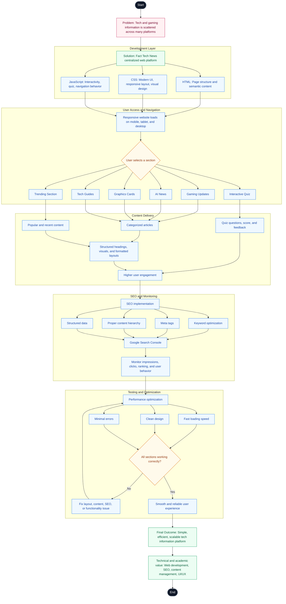
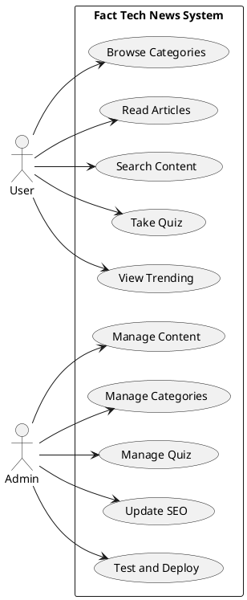
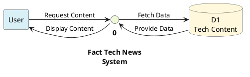
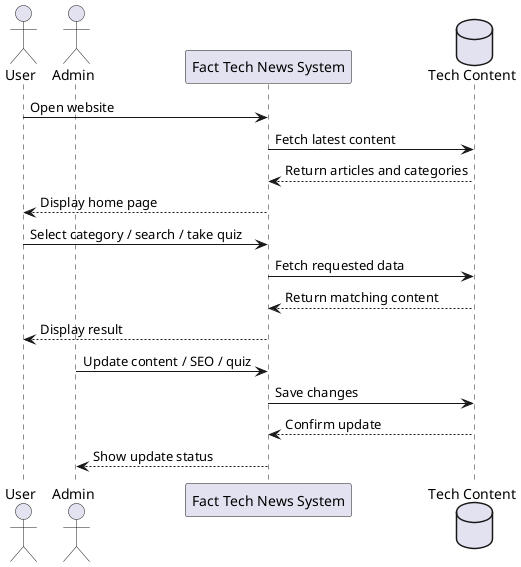
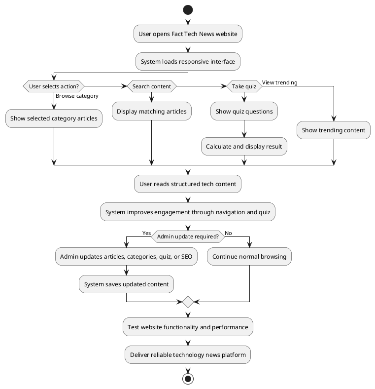
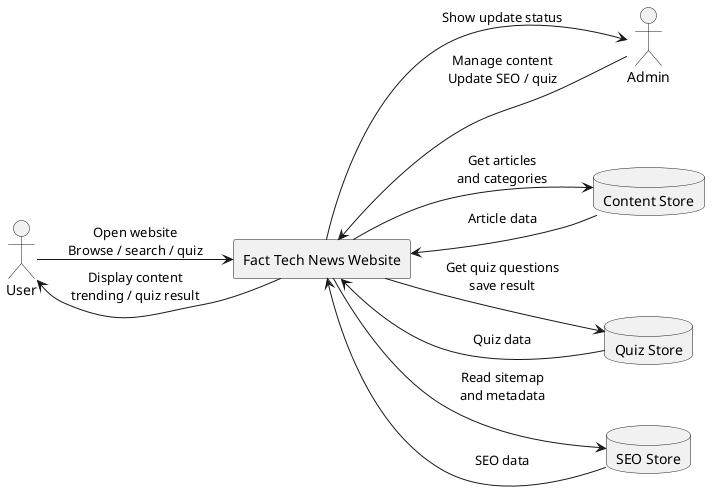
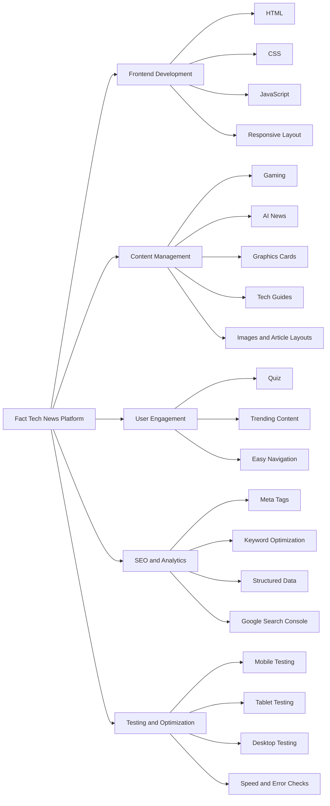

# Fact Tech News - Flowchart, Use Case Diagram, and DFD Level 0

This document contains the main system diagrams for **Fact Tech News**, a web-based technology and gaming news platform developed using **HTML, CSS, and JavaScript**. The diagrams describe how users access content, how the admin manages the platform, and how data flows through the system.

## 1. System Flowchart

## 2. Use Case Diagram

This simple use case diagram shows the main actions performed by the **User** and the **Admin**.

## 3. DFD Level 0

This simple DFD Level 0 diagram shows the main data flow between the user, the website system, and the tech content data store.

## 4. Sequence Diagram

This sequence diagram shows how the user and admin interact with the Fact Tech News system.

## 5. Activity Diagram

This activity diagram shows the main working flow of the Fact Tech News platform.

## 6. System Flow Diagram

This system flow diagram shows the overall movement of requests, processing, stored data, and output in the Fact Tech News platform.

## 7. System Module Diagram

